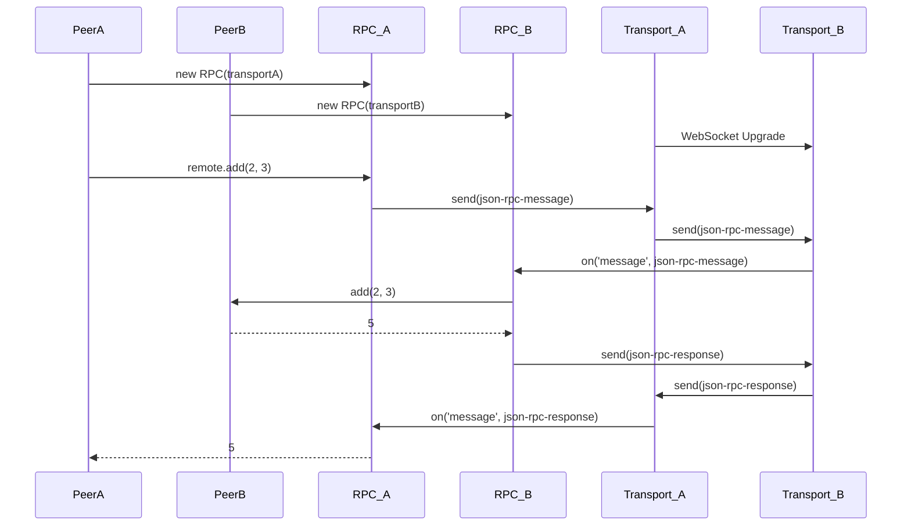

# New RPC Library: `json-rpc-ws`

This document outlines the design for a new RPC library to replace `kkrpc`. The new library, tentatively named `json-rpc-ws`, will be a simple, modern, and easy-to-use library for bidirectional JSON-RPC over pluggable transports.

## Requirements

The library must meet the following requirements:

- **Transport-agnostic:** The core RPC logic should be separated from the transport layer.
- **WebSocket Transport:** Provide a WebSocket transport implementation.
- **Protocol:** Implement the JSON-RPC 2.0 specification.
- **Bidirectional/Peer-to-Peer:** The distinction between client and server should be based on the connection flow, not on roles. Both sides should be able to expose APIs.
- **Node.js compatible:** The library should not be Bun-specific and should work with Node.js as well.
- **Typed method calling:** Instead of `call(clientId, method, params)`, the API should allow direct method calls like `client.method(params)`.
- **Streaming:** Support streaming of responses for long-running operations via callbacks.
- **Modern:** Use modern TypeScript features like `async/await`.
- **Easy to use:** Provide a simple and intuitive API.
- **Lightweight:** Have a small footprint and minimal dependencies.

## High-Level Architecture

The library will have a layered architecture:

1.  **Core `RPC` Class:** This class will handle the JSON-RPC 2.0 protocol, method exposing, and typed method calling. It will be transport-agnostic.
2.  **Transport Interface:** A `Transport` interface will define the contract for sending and receiving messages.
3.  **WebSocketTransport:** A concrete implementation of the `Transport` interface for WebSockets.

This design will allow for other transports (e.g., HTTP, WebRTC) to be added in the future.

### Message Format

The library will use the JSON-RPC 2.0 message format as a base, with some extensions to support streaming.

**Request:**

```json
{
  "jsonrpc": "2.0",
  "method": "procedureName",
  "params": [ ... ],
  "id": "request-id"
}
```

**Response:**

```json
{
  "jsonrpc": "2.0",
  "result": { ... },
  "id": "request-id"
}
```

**Error:**

```json
{
  "jsonrpc": "2.0",
  "error": {
    "code": -32600,
    "message": "Invalid Request"
  },
  "id": "request-id"
}
```

**Stream Chunk:**

```json
{
  "jsonrpc": "2.0",
  "method": "stream.chunk",
  "params": {
    "id": "request-id",
    "chunk": { ... }
  }
}
```

**Stream End:**

```json
{
  "jsonrpc": "2.0",
  "method": "stream.end",
  "params": {
    "id": "request-id"
  }
}
```

## API

### `RPC`

```typescript
class RPC<T extends Record<string, Function>> {
  constructor(transport: Transport);

  // Expose methods to the other peer
  expose(methods: T): void;

  // Get a proxy to the remote peer's API
  remote: <TRemote extends Record<string, Function>>() => TRemote;

  on(event: "open" | "connection", listener: (clientId?: string) => void): void;
  on(
    event: "close" | "disconnection",
    listener: (clientId?: string) => void
  ): void;
}
```

### `Transport`

```typescript
interface Transport {
  send(message: any): void;
  on(event: "message", listener: (message: any) => void): void;
  on(event: "open" | "connection", listener: (clientId?: string) => void): void;
  on(
    event: "close" | "disconnection",
    listener: (clientId?: string) => void
  ): void;
}
```

### `WebSocketTransport`

```typescript
class WebSocketTransport implements Transport {
  constructor(urlOrOptions: string | { port: number; host?: string });

  // ... transport implementation
}
```

## Implementation Plan

1.  Create a new directory `json-rpc-ws` in the root of the project.
2.  Initialize a new Node.js project in this directory (usable by Bun and Node).
3.  Implement the `RPC` class and the `Transport` interface.
4.  Implement the `WebSocketTransport` class.
5.  Write unit tests for the library.
6.  Integrate the new library into the `controller` and `agent` projects.
7.  Remove `kkrpc` from the dependencies.
8.  Update `AGENTS.md` to reflect the new RPC library.

## Mermaid Diagram


